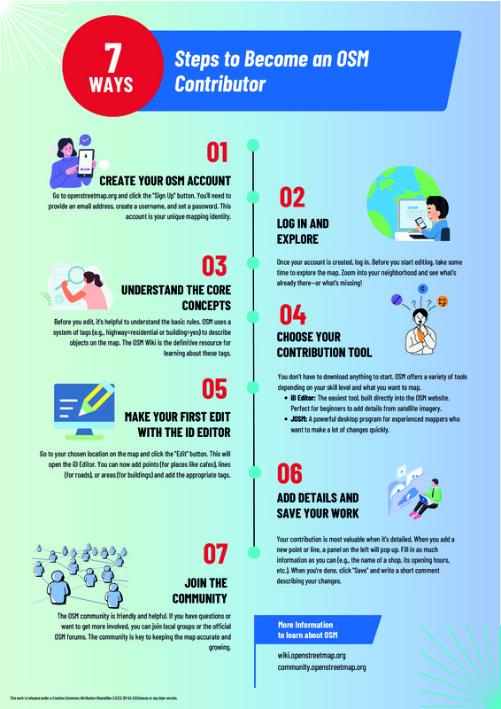

Many followed the call for posters and the results are AMAZING. We thank all participants for the great work! Some more information can be found on our [call for posters](/calls/posters) page.

*Please click on thumbnail to download PDF*

<h2 id="1">Public Transport System in Malaysia</h2>
<h3>Zumaidi Zainuddin</h3>

This poster highlights the comprehensive public transport system in Malaysia, covering air, water, and land transport. The maps shown are very helpful in educating the public about the infrastructure provided by the Government of Malaysia for its 35 million people across 13 states.

Kuala Lumpur, the capital city, serves as the central hub of public transport, with major rail networks and highways connected nationwide. The public can use these maps to choose the most convenient mode of travel within Malaysia.

Malaysia is served by many international and domestic airports, with KLIA (Kuala Lumpur International Airport) as the main gateway. The national carrier, Malaysia Airlines (MAS), connects Malaysia to destinations all over the world.

Being surrounded by seas and located along the busy Straits of Malacca shipping route, Malaysia also has many major ports and jetties that support water transport.

For land transport, Malaysia is well-connected by an extensive rail network and highway system. The public can view routes and stations of MRT, LRT, BRT, ART, and train services through the map, including even historical train routes. Malaysia also has an excellent bus service, with thousands of bus stops and routes clearly shown on the map.

For those travelling by highways using cars, motorcycles, or trucks, the maps also show highway routes and kilometre markers, helping users know exactly where they are.

I believe this map provides informative, accessible, and convenient information for Malaysians, as it is available not only on desktop but also on mobile phones.

<h2 id="2">Notable trees in OSM</h2>
<h3>Ivan Ruggiero</h3>

My poster presents different aspects of tree mapping in OpenStreetMap, divided in four parts:

Notable trees (top left)
OSM records different categories of notable trees, such as natural monuments, landmarks, and sacred trees. Examples include Celtic clootie trees or Serbian zapis.

Tree QA (top right)
Tree data can contain errors. Tools like QLever and Osmose can help detect issues, and a dedicated MapRoulette project invites contributors to improve data quality.

Monumental trees of Italy (bottom left)
Italy officially recognizes almost 5,000 monumental trees, recorded by the government. About 25% are already mapped in OSM.

Slenderness ratio and how to contribute (bottom right)
The ratio between height and circumference can reveal measurement errors and help with validation. Contributors can join at any level, from adding a single tree node, to measuring girths and heights, to identifying species with dedicated apps.

<h2 id="3">Synthetic Cities</h2>
<h3>Cole White</h3>

This project explores the use of cartographic design, machine learning, and open data to automate the extraction of building footprints from historical fire insurance plans. Drawing on OpenStreetMap and tools like QGIS and Python, I developed a workflow to generate synthetic training data that mimics the visual style and spatial structure of hand-drawn maps. By combining these synthetic map graphics with corresponding annotation files, the project enables scalable training of computer vision models, offering a new approach to digitizing and analyzing historical spatial data across cities and time periods. The work builds on ongoing efforts at the University of Toronto Map and Data Library to make historical maps more accessible for spatial research.

<h2 id="4">Mapping on the Move : A New Workflow for OSM</h2>
<h3>Altilunium</h3>

From our experience introducing OpenStreetMap to the general public, we found that people are generally very interested in OSM, but many find it too complex. So we asked ourselves: what if we simplify everything into just two things?

1. No need to install any application or register for an account—just use the website directly.
2. Mapping on the go with plain text descriptions, without having to learn the complex tagging system right away.

With this approach, users can map immediately while they’re out in the field, simply by visiting the website (https://altilunium.github.io/sakumaps/v2). Later, they can export their packaged survey data as GeoJSON—one of the main features of this app—and we’ll help them upload it to OSM with the proper tagging.

Beyond OSM mapping, this app can also serve personal purposes—like creating a local-first “geo journal.” Users can share short stories tied to specific coordinates. Each note stores its location and a timestamp for when it was created or edited. Everything is saved securely and locally on the user’s device, with privacy guaranteed. Over time, as users keep writing entries whenever they go outside, the geo journal becomes a nostalgic record of past moments. You can open the app, browse the map, and think: “Oh, a few years ago, that afternoon, this funny thing happened right here.” This isn’t just a regular diary—each story comes with an inherent spatiotemporal element: exact coordinates and the time of the event. These data points are captured in real time using GPS and timestamps, which makes the whole experience feel a bit magical.

<h2 id="5">Conferences of OpenStreetMap happen around the world</h2>
<h3>Gregory Marler, LivingWithDragons.com</h3>

Do you recognise these logos, can you name them and the year? How about the maps, can you match the places to the conference?
It's brilliant when the OpenStreetMap community happens in different places. I wanted to show how much that was happening with all the logos, but it's difficult to fit them all on one poster. I had to only include the most recent State of the Map of each region or country, and still exclude some that hadn't taken place recently.
Additionally I show a map of each location, and in differing styles, to further illustrate the variety of identities in our community and the value for bringing it to many locations.

<h2 id="6">An Open-Source Framework for Street-Level Flood Hazard Assessment Using Multi-Factor Weighted Risk Modeling</h2>
<h3>Merce Jaen Adlaon & Daniel Lopez, PhD</h3>

<h2 id="7">Hospital Accessibility in the Philippines</h2>
<h3>Ariel Dome</h3>

<h2 id="8">Lighthouses of the Philippines</h2>
<h3>Ariel Dome</h3>

<h2 id="9">Mapping to Matter: Indigenous Visibility & Disaster Resilience with OSM in Nepal</h2>
<h3>Niruta Neupane</h3>

This poster highlights my journey with OpenStreetMap (OSM) and its role in making overlooked places in Nepal visible, safer, and more resilient.

The work began with mapping Chepang settlements in Raksirang, a historically marginalized community where many villages were missing from official maps. Through OSM, we added critical data such as roads, paths, buildings, and services, enabling planners and local actors to use this information for outreach and development.

I also contributed to disaster mapping, including flood-resilience work along the Roshi Khola. Here, we trained and engaged mappers to trace flood extent and blocked roads, producing more reliable data for responders and raising local awareness of open mapping. The process established a repeatable workflow — train → map → validate — that can be applied to other hazard-prone areas.

Beyond technical mapping, I have invested in community building and knowledge sharing. This includes organizing the OSM Contributors Meetup, Geo-special September, school-based map literacy programs, and university-level trainings. These efforts were recognized through the Open Mapping Guru Fellowship and the Women Leaders in OSM Grant, which supported inclusive participation and mentoring.

<h2 id="10">7 Steps to Become an OpenStreetMap Contributor</h2>
<h3></h3>

The poster highlights a simple and practical
guide designed to help beginners get started with OpenStreetMap. It walks
through seven essential steps, from creating an account and learning the
basics, to mapping,  and engaging with the community.
I hope this poster will inspire more people to contribute to OSM and
strengthen our collective efforts in building free, open geographic data.

<h2 id="11">Roads Saves Lives</h2>
<h3>Paulo Medina & Josefina Marie P.</h3>

The poster is a personal research project on simulating healthcare accessibility in the context of our home province, Pampanga and in the context of the leading cause of mortality in the region where my province is located, which is cardiovascular diseases, which we plan to extend soon as a formal study.

Using the OpenStreetMap road network, my sister, a medical doctor, and I, a data scientist, were able to craft a pipeline for Road Network Monte Carlo Simulations and Survival Analysis for our home province and other provinces, allowing simulations of emergency responses to hypothetical cardiac arrest cases within a province and derivation of actionable insights on addressing higher average travel times (to the patient and to the hospital) and higher average mortality rates for given areas within the province.

<h2 id="12">THE NEW OSM SWISS STYLE - Swiss map design meets OpenStreetMap</h2>
<h3>Stefan Keller</h3>

The OSM Swiss Style combines the tradition of Swiss cartography with modern open technologies to create a clear, balanced web basemap built on OpenStreetMap data. Developed at OST with partners ETH Zurich, Sourcepole, and the Swiss OSM Association, it features refined color schemes, distinctive symbols, and vector tiles, supporting applications in tourism, mobility, and beyond.

<h2 id="13">OpenHerMap & TomTom: Collaborative Mapping Party Using Ushahidi and MapRoulette</h2>
<h3></h3>

OpenHerMap & TomTom: Collaborative Mapping Party Using Ushahidi and
MapRoulette documents a community effort to improve OpenStreetMap (OSM)
coverage of women-only public facilities and the essential access features
that connect to them. An online kick-off on 30 Aug 2024 launched a one-week
challenge (30 Aug–8 Sep 2024) using two complementary tools: MapRoulette
for mapping pedestrian networks and OpenHerMap’s Ushahidi for reporting
women-only spaces (e.g., toilets, prayer rooms, lactation rooms, and
related facilities).

<h2 id="14">OpenStreetMap contributor activity of the past 5 years</h2>
<h3>Benjamin Herfort</h3>

The poster shows monthly mapping activity in OSM per country since 1st
January 2020. For each country and month we count the number of the
distinct contributors. We consider the location of the edit, but not the
"home country" of the contributor. To run a similar analysis you can use
the ohsomeNow stats dashboard and API: stats.now.ohsome.org
